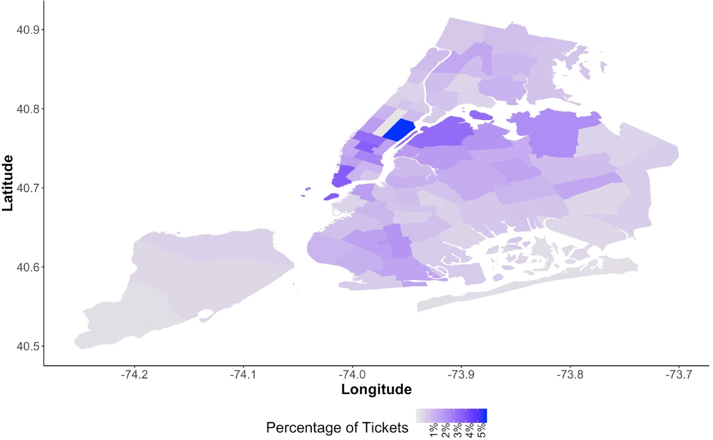
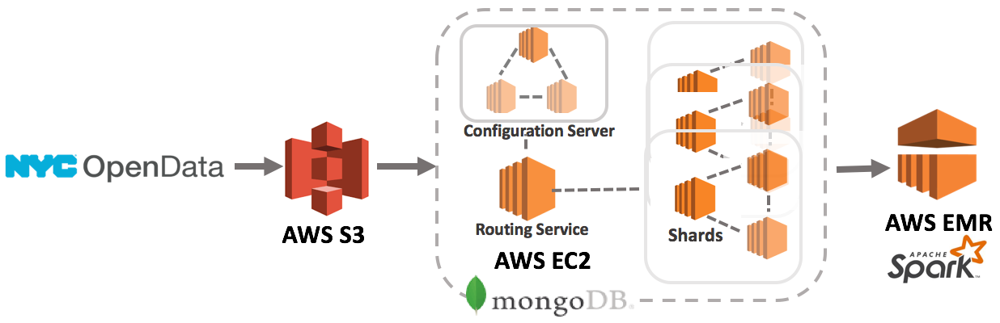
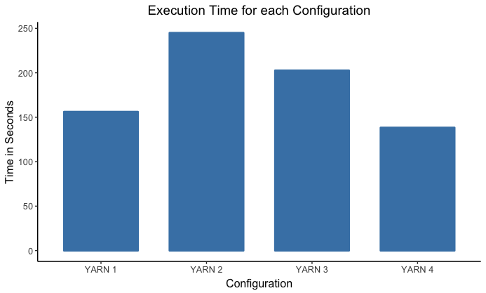
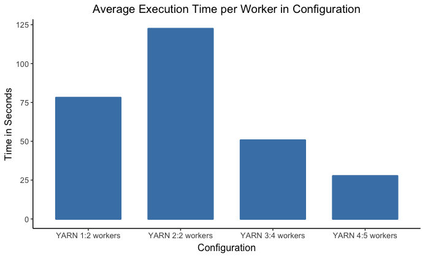

# Distributed Clustering Analysis for NYC Parking Tickets Violation. 

**[Paper]() accepted** by [IEEE SCI 2019](http://www.smart-world.org/2019/sci/)       
**Authors**: Even Liu, Xi Yang, Nan Lin, Fiorella Tenorio, Paul Intrevado, Diane Myung-kyung Woodbridge.  

## Table of Content
- Project Goal
- Data Source
- [Technical Workflow](#Workflow)
- [Preprocessing & Feature Engineering & Modeling](#Preprocessing)
- [Experiment Results](#Experiment-Results)

## Project Goal
We employed distributed systems to explore the similarities in parking ticket records using unsupervised  machine  learning  techniques  on  a  large  dataset.    
   
The question is given the time of day and a vehicle characteristics, in which precincts is that vehicle more prone to be ticketed?    
   
Another goal is to compare the economic and computational efficiency of different distributed system configures on AWS EMR.   

## Data Source
NYC OpenData [Parking Violations Issued (2015 - 2018)](https://data.cityofnewyork.us/City-Government/Parking-Violations-Issued-Fiscal-Year-2015/c284-tqph)         
- 37 million ticket records (9 GB) collected by the New York City Department of Finance    
- Ticket Distribution Visualization
      
   
## Technical Workflow<a name="Workflow"/>          
             
      
Amazon Web Services including S3, EC2 andEMR,  and  tools  like  MongoDB  and  Apache  Spark  were  used in  this  endeavor.

## Preprocessing & Feature Engineering & Modeling<a name="Preprocessing"/>

- [Proprocessing](data_cleaning.py)       
Standardization, missing value imputation, only keep vehicle-related features and timing related features  

- [Feature Engineering & Modeling](FeatureEngineering_Modeling.py)  
	- Feature Engineering: OneHotEncoding
	- Model: k-means clustering   

## Experiment Results <a name="Experiment-Results"/>
    
It's  time  efficient  for  a  cluster  with  more  workers  instead of fewer workers with large memory space for the utilized dataset. However we observed a trade-off between the execution time and  the  total  cost  for  the  cluster  configuration.     
       
### Results
       
|    |YARN 1|YARN 2|YARN 3|YARN 4|
|:---|:----:|:----:|:----:|:----:|
|Number of instances|3 |3 |5 |6 |
|Number of cores per worker|16 | 8 | 8 | 8 |
|RAM per worker (GB)| 32 | 16 | 16 | 16 |
|Time per model (sec)| 156.1064 | 244.8653 | 202.6197 | 138.2841 |
|Cost per model (USD)| 0.94 | 0.73 | 1.01 | 0.83 |
|Distance from Centroid (scaled WSSSE) | 2.1277 | 2.1210 | 2.1089 | 2.1136 |
          
### Figures   
     
- Execution Time in Different YARN         
      

      
- Average  Execution  Time  per  Worker  in  DifferentYARN   
       
        
